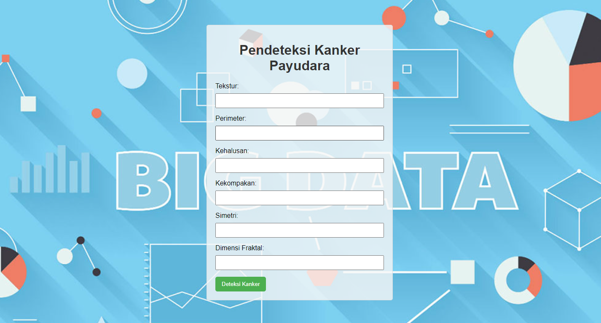

<div align="center">

<a href="https://www.facebook.com/profile.php?id=100030246067484"></a>
<a href="https://instagram.com/bayu_pamungkas031?igshid=NzZlODBkYWE4Ng=="></a>


# _WEBSITE PENDETEKSI KANKER PAYUDARA_

</div>

Website ini merupakan contoh program pendeteksi kanker payudara yang dibangun dengan menggunakan bahasa pemrograman Python, framework Flask, dan menerapkan konsep OOP (Object-Oriented Programming). Program ini dirancang untuk membantu pengguna dalam melakukan deteksi kemungkinan kanker payudara berdasarkan analisis fitur tertentu.

<div align="center">



</div>

Data yang dimasukkan ke dalam program ini mencakup sejumlah fitur yang diukur atau dihitung dari hasil pemeriksaan pasien. Fitur-fitur ini kemudian digunakan dalam proses analisis untuk mencoba mendeteksi kemungkinan adanya kanker payudara. Berikut adalah penjelasan untuk setiap data yang dimasukkan:

**tekstur** : Nilai tekstur dari gambaran medis payudara pasien.

**perimeter** : Panjang keliling payudara.

**kehalusan** : Tingkat kehalusan permukaan payudara.

**kekompakan** : Tingkat kekompakan atau kerapatannya.

**simetri** : Tingkat simetri antara payudara kiri dan kanan.

**dimensi_fraktal** : Nilai dimensi fraktal, yang dapat memberikan informasi tentang kompleksitas struktur payudara.

Data ini seharusnya diperoleh dari hasil pemeriksaan medis atau citra medis yang telah diambil, seperti citra mammogram atau hasil tes lainnya. Dalam aplikasi dunia nyata, data ini dapat dihasilkan melalui alat medis khusus dan harus diinterpretasikan oleh profesional kesehatan untuk memberikan diagnosis yang akurat. Program ini hanyalah simulasi sederhana dan tidak boleh digunakan sebagai pengganti penilaian medis profesional.

Jika data sudah dimasukkan maka sistem akan mendeteksi data apakah hasilnya akan positif atau negatif kanker

<div align="center">

### Jika Hasil Positif


### Jika Hasil Negatif


</div>


## 1. Code Utama (deteksi_kanker.py)

Code dibawah murapakan code python, yang fungsi sebagai code utama untuk berjalannya sebuah program deteksi kanker payudara.

        from flask import Flask, render_template, request

        app = Flask(__name__)

        class PendeteksiKankerPayudara:
            def __init__(self, tekstur, perimeter, kehalusan, kekompakan, simetri, dimensi_fraktal):
                self.tekstur = tekstur
                self.perimeter = perimeter
                self.kehalusan = kehalusan
                self.kekompakan = kekompakan
                self.simetri = simetri
                self.dimensi_fraktal = dimensi_fraktal

            def analisis_fitur(self):
                hasil = self.tekstur * 0.5 + self.perimeter * 0.3 + self.kehalusan * 0.2
                return hasil

            def deteksi_kanker(self):
                hasil_analisis = self.analisis_fitur()

                if hasil_analisis > 0.7:
                    return "Deteksi kanker payudara positif"
                else:
                    return "Deteksi kanker payudara negatif"


        @app.route('/', methods=['GET', 'POST'])
        def index():
            if request.method == 'POST':
                tekstur = float(request.form['tekstur'])
                perimeter = float(request.form['perimeter'])
                kehalusan = float(request.form['kehalusan'])
                kekompakan = float(request.form['kekompakan'])
                simetri = float(request.form['simetri'])
                dimensi_fraktal = float(request.form['dimensi_fraktal'])

                data_pasien = PendeteksiKankerPayudara(tekstur, perimeter, kehalusan, kekompakan, simetri, dimensi_fraktal)

                hasil = data_pasien.deteksi_kanker()

                return render_template('hasil.html', hasil=hasil)

            return render_template('index.html')

        if __name__ == '__main__':
            app.run(debug=True)


### Table 1. Penjelasan Code Utama

<div align="center">

| Bagian                   | Keterangan                                                                                                        |
|--------------------------|-------------------------------------------------------------------------------------------------------------------|
| **Kode Python Utama**    |                                                                                                                   |
| Import Modul             | Menggunakan modul Flask untuk membuat aplikasi web.                                                               |
| ```python from flask import Flask, render_template, request ``` |                                                                                                       |
| Inisialisasi Flask App   | Membuat instance Flask.                                                                                            |
| ```python app = Flask(__name__) ``` |                                                                                                      |
| Class PendeteksiKankerPayudara | Mendefinisikan kelas untuk representasi pasien dan pendeteksian kanker payudara.                               |
| ```python class PendeteksiKankerPayudara: # ... ``` |                                                                |
| ```python def analisis_fitur(self): # ... ``` |                                                                    |
| ```python def deteksi_kanker(self): # ... ``` |                                                                   |
| **Route Index ("/")**    |                                                                                                                   |
| Handle GET and POST Requests | Menangani permintaan GET dan POST pada route utama.                                                              |
| ```python @app.route('/', methods=['GET', 'POST']) def index(): # ... ``` |                                   |
| **HTML Template**        |                                                                                                                   |
| HTML Form (index.html)   | Membuat formulir untuk input data pasien.                                                                         |
| ```html <form method="post" action="/"> <!-- ... --> </form> ``` |                                                 |
| Hasil Deteksi (hasil.html)| Menampilkan hasil deteksi kanker.                                                                                 |
| ```html <div class="overlay"> <!-- ... --> </div> ``` |                                                                 |
| **Menjalankan Aplikasi** |                                                                                                                   |
| Main Execution Block     | Menjalankan aplikasi saat skrip dijalankan.                                                                      |
| ```python if __name__ == '__main__': app.run(debug=True) ``` |                                                   |

</div>


## 2. Code Halaman Utama (index.html)


Code berikut merupakan sebuah code html untuk membuat tampilan halaman utama dari program deteksi kanker payudara.

    <!DOCTYPE html>
    <html lang="en">
    <head>
            <meta charset="UTF-8">
            <meta http-equiv="X-UA-Compatible" content="IE=edge">
            <meta name="viewport" content="width=device-width, initial-scale=1.0">
            <title>Pendeteksi Kanker Payudara</title>
            <style>
        
            </style>
    </head>
        <body>
        <form method="post" action="/">
            <h1>Pendeteksi Kanker Payudara</h1>
            <label for="tekstur">Tekstur:</label>
            <input type="text" name="tekstur" required><br>

            <label for="perimeter">Perimeter:</label>
            <input type="text" name="perimeter" required><br>

            <label for="kehalusan">Kehalusan:</label>
            <input type="text" name="kehalusan" required><br>

            <label for="kekompakan">Kekompakan:</label>
            <input type="text" name="kekompakan" required><br>

            <label for="simetri">Simetri:</label>
            <input type="text" name="simetri" required><br>

            <label for="dimensi_fraktal">Dimensi Fraktal:</label>
            <input type="text" name="dimensi_fraktal" required><br>

            <button type="submit">Deteksi Kanker</button>
        </form>
    </body>
    </html>

### Table 2. Penjelasan Code Halaman Utama

<div align="center">

| Bagian                                        | Penjelasan                                              |
| --------------------------------------------- | ------------------------------------------------------- |
| `<html lang="en">`                             | Awal dari dokumen HTML dengan penentuan bahasa.         |
| `<head>`                                      | Metadata dan tautan ke sumber daya eksternal.           |
| `<meta charset="UTF-8">`                       | Set karakter dokumen ke UTF-8.                          |
| `<meta http-equiv="X-UA-Compatible" content="IE=edge">` | Kompatibilitas dengan Internet Explorer.        |
| `<meta name="viewport" content="width=device-width, initial-scale=1.0">` | Pengaturan tampilan halaman.                |
| `<title>Pendeteksi Kanker Payudara</title>`    | Judul halaman yang akan ditampilkan pada tab peramban. |
| `<style>`                                     | Tempat untuk aturan gaya CSS.                           |
| `<body>`                                      | Elemen utama yang berisi konten halaman.               |
| `<form method="post" action="/">`              | Formulir dengan metode POST dan tujuan ke root path.   |
| `<h1>Pendeteksi Kanker Payudara</h1>`          | Judul besar formulir.                                  |
| `<label for="tekstur">Tekstur:</label>`       | Label untuk input tekstur.                              |
| `<input type="text" name="tekstur" required><br>` | Kotak input teks untuk nilai tekstur.              |
| `<button type="submit">Deteksi Kanker</button>` | Tombol untuk mengirim formulir.                         |

</div>

## 3. Code Halaman Hasil Deteksi (hasil.html)

        <!DOCTYPE html>
        <html lang="en">
        <head>
            <meta charset="UTF-8">
            <meta http-equiv="X-UA-Compatible" content="IE=edge">
            <meta name="viewport" content="width=device-width, initial-scale=1.0">
            <title>Hasil Deteksi Kanker Payudara</title>
            <style>

            </style>
        </head>
        <body>
            <div class="overlay">
                <div class="result-container">
                <h1>Hasil Deteksi Kanker Payudara</h1>
                    <p>{{ hasil }}</p>
                    <button onclick="redirectToIndex()">Kembali ke Halaman Utama</button>
                </div>
            </div>

            <script>
                function redirectToIndex() {
                window.location.href = "/";
                }
            </script>
        </body>
        </html>

### Table 3. Penjelasan Code Halaman Hasil

<div align="center">

| Bagian             | Penjelasan                                           |
| ------------------ | ---------------------------------------------------- |
| `<!DOCTYPE html>`   | Mendefinisikan jenis dokumen dan versi HTML.          |
| `<html lang="en">`  | Awal dari dokumen HTML dengan penentuan bahasa.      |
| `<head>`           | Metadata dan tautan ke sumber daya eksternal.        |
| `<meta charset="UTF-8">` | Set karakter dokumen ke UTF-8.                   |
| `<meta http-equiv="X-UA-Compatible" content="IE=edge">` | Kompatibilitas dengan Internet Explorer. |
| `<meta name="viewport" content="width=device-width, initial-scale=1.0">` | Pengaturan tampilan halaman.            |
| `<title>Hasil Deteksi Kanker Payudara</title>` | Judul halaman yang akan ditampilkan pada tab peramban. |
| `<style>`          | Tempat untuk aturan gaya CSS.                          |
| `body`             | Gaya dasar untuk elemen `body`.                       |
| `.result-container` | Gaya untuk elemen dengan kelas `result-container`.    |
| `h1`               | Gaya untuk elemen `h1`.                                |
| `p`                | Gaya untuk elemen `p`.                                 |
| `button`           | Gaya untuk elemen `button`.                            |
| `<script>`         | Menyertakan script JavaScript untuk meredirect ke halaman utama. |

</div>